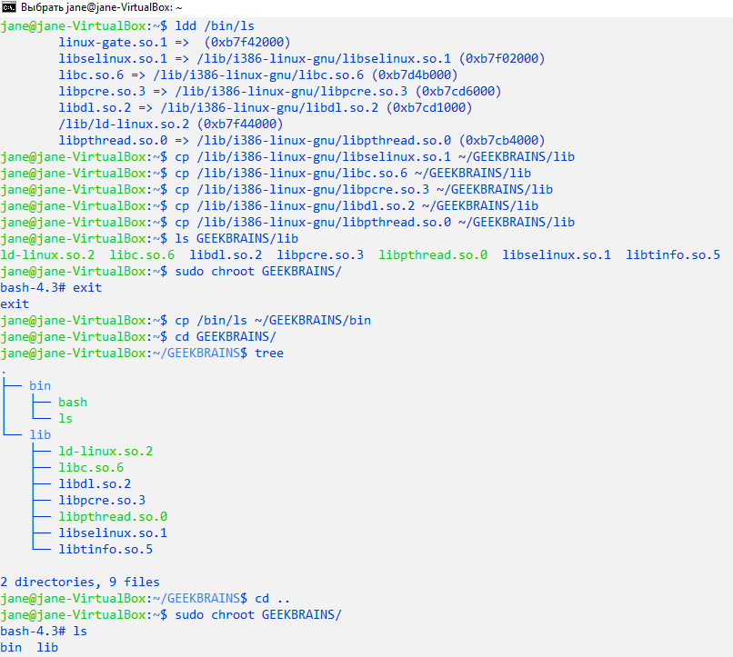

# Containerization. Workshop 1. Homework. Тогочакова Евгения. 4544
## Изоляция с помощью chroot. 
### Подготовка и запуск chroot. 
```
jane@jane-VirtualBox:~$ mkdir GEEKBRAINS
jane@jane-VirtualBox:~$ cd GEEKBRAINS/
jane@jane-VirtualBox:~/GEEKBRAINS$ mkdir bin lib
jane@jane-VirtualBox:~/GEEKBRAINS$ l
jane@jane-VirtualBox:~/GEEKBRAINS$ cp /bin/bash ~/GEEKBRAINS/bin
jane@jane-VirtualBox:~/GEEKBRAINS$ tree
jane@jane-VirtualBox:~/GEEKBRAINS$ ldd /bin/bash
jane@jane-VirtualBox:~/GEEKBRAINS$ cp /lib/i386-linux-gnu/libtinfo.so.5 ~/GEEKBRAINS/lib
jane@jane-VirtualBox:~/GEEKBRAINS$ cp /lib/i386-linux-gnu/libdl.so.2 ~/GEEKBRAINS/lib
jane@jane-VirtualBox:~/GEEKBRAINS$ cp /lib/i386-linux-gnu/libc.so.6 ~/GEEKBRAINS/lib
jane@jane-VirtualBox:~/GEEKBRAINS$ cp /lib/ld-linux.so.2 ~/GEEKBRAINS/lib
jane@jane-VirtualBox:~/GEEKBRAINS$ l lib
ld-linux.so.2*  libc.so.6*  libdl.so.2  libtinfo.so.5
jane@jane-VirtualBox:~/GEEKBRAINS$ cd ..
jane@jane-VirtualBox:~$ sudo chroot GEEKBRAINS/
[sudo] password for jane:
bash-4.3#
```


### Копирование библиотек для ls.
```
jane@jane-VirtualBox:~$ ldd /bin/ls 
jane@jane-VirtualBox:~$ cp /lib/i386-linux-gnu/libselinux.so.1 ~/GEEKBRAINS/lib           
jane@jane-VirtualBox:~$ cp /lib/i386-linux-gnu/libc.so.6 ~/GEEKBRAINS/lib                                                                                               
jane@jane-VirtualBox:~$ cp /lib/i386-linux-gnu/libpcre.so.3 ~/GEEKBRAINS/lib                                                                                            
jane@jane-VirtualBox:~$ cp /lib/i386-linux-gnu/libdl.so.2 ~/GEEKBRAINS/lib                                                                                              
jane@jane-VirtualBox:~$ cp /lib/i386-linux-gnu/libpthread.so.0 ~/GEEKBRAINS/lib                                                                                         
jane@jane-VirtualBox:~$ ls GEEKBRAINS/lib                                                                                                                               
ld-linux.so.2  libc.so.6  libdl.so.2  libpcre.so.3  libpthread.so.0  libselinux.so.1  libtinfo.so.5                                                                                                                       
jane@jane-VirtualBox:~$ cp /bin/ls ~/GEEKBRAINS/bin                                                                                                                     
jane@jane-VirtualBox:~$ cd GEEKBRAINS/                                                                                                                                  
jane@jane-VirtualBox:~/GEEKBRAINS$ tree
jane@jane-VirtualBox:~/GEEKBRAINS$ cd .. 
jane@jane-VirtualBox:~$ sudo chroot GEEKBRAINS/
bash-4.3# ls
bin  lib
bash-4.3# ls -a  
.  ..  ld-linux.so.2  libc.so.6  libdl.so.2  libpcre.so.3  libpthread.so.0  libselinux.so.1  libtinfo.so.5 
bash-4.3#    
```                                                                                                                                                                                                                                   


## Изоляция сетевого окружения с помощью утилиты ip
```
jane@jane-VirtualBox:~$ sudo ip netns add testns
[sudo] password for jane:
jane@jane-VirtualBox:~$ ip a
jane@jane-VirtualBox:~$ sudo ip netns exec testns bash 
root@jane-VirtualBox:~# ip a 
root@jane-VirtualBox:~# ps aux  
```


## Более глубокая изоляция с помощью утилиты unshare
```
jane@jane-VirtualBox:~$ sudo unshare --net --pid --fork --mount-proc /bin/bash
root@jane-VirtualBox:~# ip a 
root@jane-VirtualBox:~# ps aux 
root@jane-VirtualBox:~# ls 
root@jane-VirtualBox:~# ls /
```


